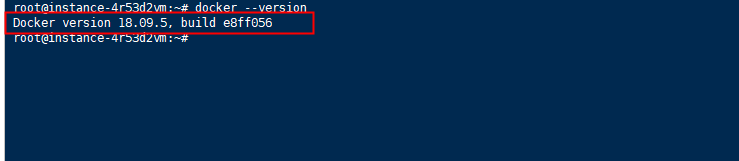

# docker + jenkins 自动化部署
> ## 为什么有docker
+ 虚拟机太大了
+ 复杂的环境，应用相互影响
+ docker 
> ## 撸前准备 docker
+ [docker download](https://www.docker.com/get-started)

+ [docker install for ubuntu](https://docs.docker.com/install/linux/docker-ce/ubuntu/)

+ docker image 镜像， 类似 node_moduels
  
> ## 开撸
检验docker是否安装成功
```
docker  --version
```
如果成功会有相应的版本号显示

然后就可以去下载自己想下载的镜像了[docker registry(镜像仓库)](https://hub.docker.com/_/jenkins?tab=tags&page=1) 类似 npm 仓库
也可以通过
```
docker search
```
来搜索镜像是否存在。接下来就是拉去镜像，默认的话docker 都会拉最新的镜像包，如果要拉取特定的版本在后面在，这边以Jenkins为例子。 
```
docker pull jenkins/jenkins:lts
```
！切记，直接docker pull jenkins 会拉去 jenkins:latest 版本是2.60.3，这个版本兼容问题贼大。有兴趣的同学可以去试一试。
下完的镜像都在docker image 下面，通过 命令 <font color="color=#0099ff">docker images</font> 或者 <font color="color=#0099ff">docker image ls</font> 可以查看安装过的镜像。每个镜像可以看作一个个独立的盒子，也可以看成单独的app可以独自运行。

#### 如何运行一个image？
docker container 是docker的 image运行的容器。通过命令
<font color="color=#0099ff">docker run (image name)</font>常用一般
```
docker container run -d -p port:port --name=name -v mount:mount imageName

docker run -d -p 8000:8080 --name=jenkins -v ~/Desktop/jkins/:/var/jenkins_home jenkins
```
+ -d 后台运行
+ -p 运行端口修改
+ --name 重命名
+ -v 挂在地址

（[详细用法](https://docs.docker.com/engine/reference/commandline/container_run/)）

查看，启动，删除一个容器
```
docker container ls -a || docker ps
docker container stop (container id )
docker container start (container id )
docker container rm (container id )
docker image rm (image id )
```
查看日志
```
docker logs (container id )
```
进入容器终端
```
docker exec -it (container id ) /bin/bash
```
参数/bin/bash 表示启动一个bash交互终端。
参数-t让Docker分配一个伪终端并绑定在容器的标准输入上，-i让容器的标准输入保持打开。
> ## 构建自己的镜像
## [dockerfile](https://docs.docker.com/develop/develop-images/dockerfile_best-practices/)

+ <font color="color=#0099ff">FROM</font>指定基础镜像，必须为第一个命令
+ <font color="color=#0099ff">MAINTAINER</font>指定镜像的作者信息
+ <font color="color=#0099ff">RUN</font>构建镜像时执行的命令
+ <font color="color=#0099ff">ADD</font>将本地文件添加到容器中，tar类型文件会自动解压(网络压缩资源不会被解压)，可以访问网络资源，类似wget
+ <font color="color=#0099ff">COPY</font>功能类似ADD，但是是不会自动解压文件，也不能访问网络资源
+ <font color="color=#0099ff">CMD</font>构建容器后调用，也就是在容器启动时才进行调用。
+ <font color="color=#0099ff">EXPOSE</font>指定于外界交互的端口
+ <font color="color=#0099ff">VOLUME</font>用于指定持久化目录
+ <font color="color=#0099ff">WORKDIR</font>工作目录，类似于cd命令
```
docker build -t tagname .
```
读取当前目录下面的dockerfile文件，并运行命令。

> ## jenkins 部分


